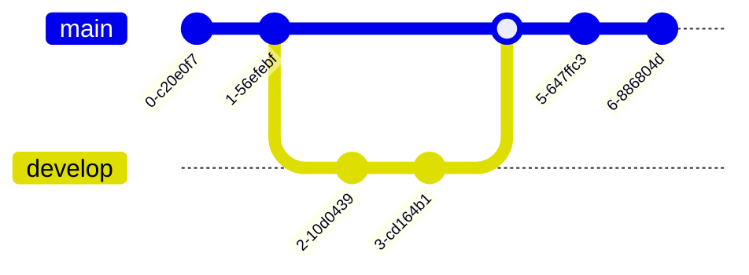

# Trabalhando com Branches

Este exercício começa de onde o anterior parou. Agora que sabemos manipular arquivos, vamos diversifcar nosso trabalho em branches.


Uma branch (ramificação) é uma forma de trabalharmos em uma linha do tempo paralela, destacada da linha principal, onde podemos desenvolver uma nova funcionalidade ou corrigir um bug de forma isolada. Trabalhamos nesta branch enquanto for necessário e, quando tudo estiver finalizado, fazemos um merge na linha principal, conveniente chamada de `master`, ou mais recentemente `main`. O gráfico abaixo ilustra este funcionamento, que parece um pouco com o Multiverso dos heróis da Marvel.



Neste exemplo, `develop`foi criada e foram feitos 2 commits nela. Com tudo concluído, os dois commits foram integrados na branch principal `main`.

Vamos fazer a mesma alteração de adicionar uma nova linha em `hello.txt`, porém agora em uma branch:

## 1) Criando uma branch

```bash
# Cria branch develop
git checkout -b devleop
# realiza mudança no arquivo 
echo "hello again!" >> hello.txt
# Visualiza mudança
cat hello.txt
# cria commit com todas as mudanças
git commit -a -m "Modifica arquivo hello.txt"
# visualiza commit no log
git log
```

## 2) Alternando entre as branches

Suponha que no meio do trabalho surja a necessidade de você consultar alguma coisa na branch principal. Você pode fazer isso simplesmente usando o comando `git checkout`, desta vez sem o `-b` já que não desejamos criar uma nova branch:

```bash
# visualiza as branches
git branch
# alterna para a branch principal
git checkout master
# confere os commits nesta branch
git log
# visualiza hello.txt
cat hello.txt
```

Para voltar para a branch que estamos trabalhando basta usar novamente o comando `git checkout`:

```bash
# Volta para develop
git checkout devleop
git log
cat hello.txt
```

## 3) Levando as mudanças para a branch principal

Existem duas formas de fazer isto, através de uma operação `merge` ou através de uma *Pull Request*. Por hora vamos explicar como funciona o merge, e mais tarde voltaremos a falar de *Pull Requests*, que são um tópico um pouco mais avançado, mas é forma como as organizações e projetos de código aberto costumam trabalhar.


Um merge funciona como se o Git fizesse um replay de todos os commits da branch de origem fossem aplicados na branch de destino. Caso um ou mais arquivos sejam modificados nas duas branches de uma maneira que o Git não saiba o que deve ser feito com aquela linha, então temos um `Conflito`. Quando isto acontece o Git interrompe o merge e cabe a nós resolver o conflito indicando quais linhas são as corretas. 

Para saber mais detalhes sobre como resolver conflitos pela linha de comando, leia [este tutorial](https://metring.com.br/guia-resolvendo-conflitos-no-git) que encontrei em português. As ferramentas que utilizaremos nos próximos módulos permitem que solucionemos conflitos de uma gráfica e mais agradável.

**IMPORTANTE:** o merge é sempre feito no sentido Destino => Origem. Ou seja, devemos fazer checkout da branch de destino e fazer merge para ela especificando a branch de origem.

Assim sendo, faça o seu primeiro merge com os seguintes comandos:

```bash
git checkout master
 git merge develop
 git log
```
## 4) Apagando uma branch

Podemos apagar uma branch que já foi mergeada e não precisamos mais através do comando abaixo.

```bash
git branch
git branch -d develop
git branch
```

## Conclusão

Apendemos aqui como trabalhar com branches e sua importância no fluxo de desenvolvimento

